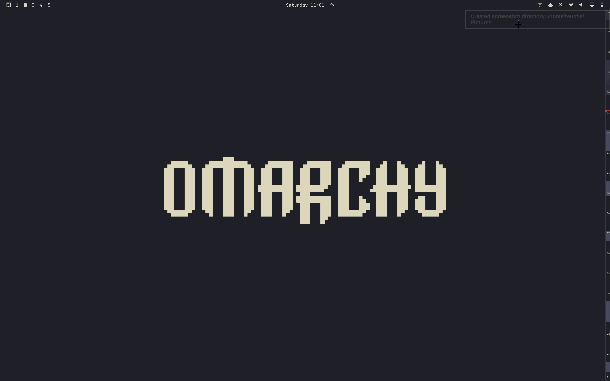
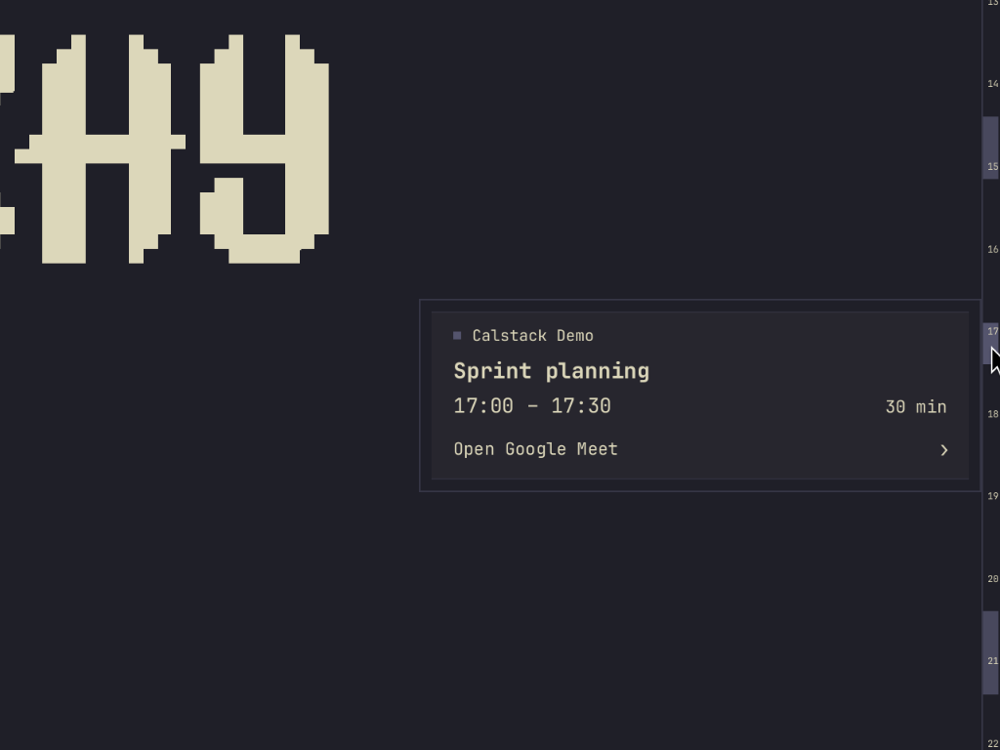

# Calstack





A small native calendar strip for Wayland and macOS. See today's events at
the edge of your screen, hover for details, and click to join a meeting.

- Local ICS files and HTTP/HTTPS/webcal subscriptions
- Recurring events, multiple calendars, and offline caching
- Native settings, theme integration, and optional start at login
- 13-pixel strip; no browser engine or continuous render loop

Works with layer-shell compositors such as Hyprland and Sway. Omarchy gets
matching colors and fonts; no Omarchy plugin is required. On macOS, pins to
the right edge of the screen as a floating always-on-top window — see the
[macOS notes](docs/configuration.md#macos) for what's different there.

## Install

Any Linux distro (prebuilt binary):

```sh
curl --proto '=https' --tlsv1.2 -LsSf \
  https://github.com/reustle/calstack/releases/latest/download/calstack-installer.sh | sh
```

Arch / Omarchy (AUR):

```sh
yay -S calstack        # build from source
yay -S calstack-bin    # prebuilt
```

From source, with Rust and the [runtime dependencies](docs/install.md):

```sh
make install PREFIX="$HOME/.local"
~/.local/bin/calstack --settings
~/.local/bin/calstack
```

On macOS: `make install-macos` builds a `Calstack.app` bundle and copies it to
`/Applications` (`make bundle-macos` builds it into `dist/` without
installing, `make uninstall-macos` removes it). It's unsigned, so the first
launch needs a right-click → Open (or System Settings → Privacy & Security →
Open Anyway) past Gatekeeper's "unidentified developer" warning.

Add your ICS subscription in Settings. Use the bottom `⋮` menu for
Settings/Refresh/Quit. Changes apply automatically; **Start at login** is
optional.

For a preview without a calendar: `calstack --demo`.

## More

[Install, autostart & uninstall](docs/install.md) ·
[Configuration & calendar support](docs/configuration.md) ·
[Development & verification](docs/development.md) ·
[Build plan](PLAN.md)

MIT licensed.
